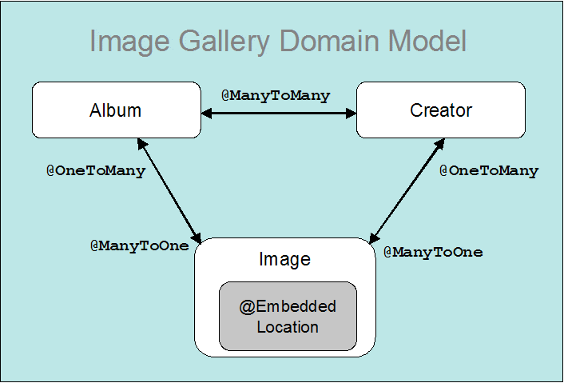

Title: Bean Validation Primer

# OpenJPA Bean Validation Primer

A new feature defined by the JPA 2.0 specification is the ability to
seamlessly integrate with a [JSR-303](http://jcp.org/en/jsr/detail?id=303)
 bean validation provider.   With minimal effort, [OpenJPA 2.0](http://openjpa.apache.org/openjpa-200.html)
 can be coupled with a [JSR-303](http://jcp.org/en/jsr/detail?id=303)
 validation provider to provide runtime data validation.  By combining
these two technologies, you get a standardized persistence solution with
the added ability to perform standardized java bean validation.

## What is Bean Validation?

Most applications, especially those that gather input from a user, contain
a significant amount of code to perform data validation.  It is typically
custom code, fragmented and littered throughout the application.  Worse,
there may be duplicate validation code at the presentation (Web) , business
(EJB), and persistence layers.	The task of keeping duplicate code in synch
can be especially problematic.	A slight modification in the code at one
layer can lead to an unforseen breakage in another.

The Bean Validation API was designed to provide a standardized method for
validating data within Java beans.  As an added feature, it seemlessly
integrates with several JEE6 technologies including [JPA 2.0](http://jcp.org/en/jsr/detail?id=317)
, [JCA 1.6](http://jcp.org/en/jsr/summary?id=322)
, and [JSF 2.0](http://jcp.org/en/jsr/detail?id=314)
.  Additionally, JEE6 complaint servers are required to support bean
validation and must include a validation provider.  While a JEE6
environment provides some simplified packaging and configuration benefits,
bean validation works equally well in a JSE environment.  For simplicity,
this primer will use a JSE environment, but the example code could be used
within a JEE6 environment with very few modifications.

While the [JSR-303 specification](http://jcp.org/en/jsr/detail?id=303)
 is very feature rich and extensible, there are three core concepts that
will be of most interest to the majority of users:  constraints, constraint
violation handling, and the validator itself.  If you are running in an
integrated environment like JPA, you will rarely have to concern yourself
with the validator; simplifying things even further.

## Validation Constraints

Constraints are a fundamental component of bean validation.  Constraints
can be placed on Java beans and/or fields and properties (collectively
labeled attributes in JPA terminology) to constrain the data within the
bean.  A constraint can either be defined using annotations or XML.  The
bean validation specification defines a small set of constraints that must
be included with every validation provider.  This small set covers most
types of simple validation in addition to a powerful regular expression
based validator.  If the built-in constraints don't fit the bill, you can
very easily build your own custom validators and matching constraints. 
Let's start by looking at some simple constraints and then move to creating
some custom constraints.

## Constraining an Entity

For the purposes of an example, let's start building the JPA domain model
for a digital image storage system. For the sake of simplicity, we'll start
with a simple entity "Image".  An [Image](http://svn.apache.org/repos/asf/openjpa/trunk/openjpa-examples/image-gallery/src/main/java/org/apache/openjpa/example/gallery/model/Image.java)
 has an ID, image type, file name, and image data.  Our system has a
requirement that the image type must be specified and the image file name
must include a valid JPEG or GIF extension.  The code below shows the
annotated Image entity with some built-in bean validation constraints
applied.

    
    package org.apache.openjpa.example.gallery.model;
    
    import javax.persistence.Entity;
    import javax.persistence.EnumType;
    import javax.persistence.Enumerated;
    import javax.persistence.GeneratedValue;
    import javax.persistence.Id;
    import javax.validation.constraints.NotNull;
    import javax.validation.constraints.Pattern;
    
    @Entity
    public class Image {
    
        private long id;
        private ImageType type;
        private String fileName;
        private byte[] data;
    
        @Id
        @GeneratedValue
        public long getId() {
        	return id;
        }
    
        public void setId(long id) {
        	this.id = id;
        }
    
        @NotNull(message="Image type must be specified.")
        @Enumerated(EnumType.STRING)
        public ImageType getType() {
        	return type;
        }
    
        public void setType(ImageType type) {
        	this.type = type;
        }
    
        @Pattern(regexp = ".*\\.jpg|.*\\.jpeg|.*\\.gif",
    	         message="Only images of type JPEG or GIF are supported.")
        public String getFileName() {
        	return fileName;
        }
    
        public void setFileName(String fileName) {
    	    this.fileName = fileName;
        }
    
        public byte[] getData() {
    	    return data;
        }
    
        public void setData(byte[] data) {
    	    this.data = data;
        }
    }
  
  
The [Image](http://svn.apache.org/repos/asf/openjpa/trunk/openjpa-examples/image-gallery/src/main/java/org/apache/openjpa/example/gallery/model/Image.java)
 class uses two built in constraints @NotNull and @Pattern. The @NotNull
constraint ensures that an [ImageType](http://svn.apache.org/repos/asf/openjpa/trunk/openjpa-examples/image-gallery/src/main/java/org/apache/openjpa/example/gallery/ImageType.java)
 is specified and @Pattern constraint uses regular expression pattern
matching to ensure the image file name is suffixed with a supported image
format.  Each constraint has corresponding validation logic that gets
executed at runtime when the Image entity is validated.  If either
constraint is not met, the JPA provider will throw a
ConstraintViolationException with the defined message.	The [JSR-303 specification](http://jcp.org/en/jsr/detail?id=303)
 also makes provisions for the use of a variable within the message
attribute.  The variable references a keyed message in a resource bundle. 
That allows for environment specific messages and localization of messages.
 See the [JSR-303 specification](http://jcp.org/en/jsr/detail?id=303)
, section 4.1.3 for additional details regarding the customization and
localization of messages.

## Custom Constraints and Validators

If the built-in constraints do not meet your needs, you can create your own
custom validators and constraints.  In our previous example, the Image
entity used the @Pattern constraint to validate the file name of the image.
 However, it did no constraint checking on the actual image data itself.  A
pattern-based constraint could potentially be used, but this is rather
inflexible and will get messy.	A custom constraint and validator provides
a more robust and flexible solution.  First, let's create a custom method
level constraint annotation named [ImageContent](http://svn.apache.org/repos/asf/openjpa/trunk/openjpa-examples/image-gallery/src/main/java/org/apache/openjpa/example/gallery/constraint/ImageContent.java).

  
    package org.apache.openjpa.example.gallery.constraint;
    
    import java.lang.annotation.Documented;
    import java.lang.annotation.Retention;
    import java.lang.annotation.Target;
    import static java.lang.annotation.ElementType.METHOD;
    import static java.lang.annotation.ElementType.FIELD;
    import static java.lang.annotation.RetentionPolicy.RUNTIME;
    
    import javax.validation.Constraint;
    import javax.validation.Payload;
    
    import org.apache.openjpa.example.gallery.model.ImageType;
    
    @Documented
    @Constraint(validatedBy = ImageContentValidator.class)
    @Target({ METHOD, FIELD })
    @Retention(RUNTIME)
    public @interface ImageContent {
        String message() default "Image data is not a supported format.";
        Class<?>[] groups() default {};
        Class<? extends Payload>[] payload() default {};
        ImageType[] value() default { ImageType.GIF, ImageType.JPEG };
    }

  
  

Now, let's create the validator class, [ImageContentValidator](http://svn.apache.org/repos/asf/openjpa/trunk/openjpa-examples/image-gallery/src/main/java/org/apache/openjpa/example/gallery/constraint/ImageContentValidator.java)
.  The logic within this validator gets executed by validation provider
when the constraint is validated.  Notice, the validator class is bound to
the constraint annotation via the validatedBy attribute on the @Constraint
annotation.

    package org.apache.openjpa.example.gallery.constraint;
    
    import java.util.Arrays;
    import java.util.List;
    
    import javax.validation.ConstraintValidator;
    import javax.validation.ConstraintValidatorContext;
    
    import org.apache.openjpa.example.gallery.model.ImageType;
    
    /**
     * Simple check that file format is of a supported type
     */
    public class ImageContentValidator implements ConstraintValidator<ImageContent, byte[] {
        private List<ImageType> allowedTypes = null;
        /**
         * Configure the constraint validator based on the image
         * types it should support.
         * @param constraint the constraint definition
         */
        public void initialize(ImageContent constraint) {
    	    allowedTypes = Arrays.asList(constraint.value());
        }
    
        /**
         * Validate a specified value.
         */
        public boolean isValid(byte[] value, ConstraintValidatorContext context) {
        	if (value == null) {
        	    return false;
    	    }
        	// Verify the GIF header is either GIF87 or GIF89
        	if (allowedTypes.contains(ImageType.GIF)) {
    	        String gifHeader = new String(value, 0, 6);
    	        if (value.length >= 6 &&
        		(gifHeader.equalsIgnoreCase("GIF87a") ||
        		 gifHeader.equalsIgnoreCase("GIF89a"))) {
    	    	return true;
    	        }
    	    }
        	// Verify the JPEG begins with SOI & ends with EOI
        	if (allowedTypes.contains(ImageType.JPEG)) {
    	        if (value.length >= 4 &&
                    value[0] == 0xff && value[1] == 0xd8 &&
                    value[value.length - 2] == 0xff &&
                    value[value.length -1] == 0xd9) {
    		        return true;
    	        }
        	}
        	// Unknown file format
    	    return false;
        }
    }

Finally, let's apply the new constraint to the getData() method on our
Image class.

  
        @ImageContent
        public byte[] getData() {
    	    return data;
        }
  

When validation of the "data" attribute occurs, the isValid() method in our [ImageContentValidator](http://svn.apache.org/repos/asf/openjpa/trunk/openjpa-examples/image-gallery/src/main/java/org/apache/openjpa/example/gallery/constraint/ImageContentValidator.java)
 will fire.  This method contains logic for performing simple validation of
 the format of the binary image data.  A potentially overlooked feature in
the [ImageContentValidator](http://svn.apache.org/repos/asf/openjpa/trunk/openjpa-examples/image-gallery/src/main/java/org/apache/openjpa/example/gallery/constraint/ImageContentValidator.java)
 is that it can also validate for a specific image type.  By definition, it
accepts for JPEG or GIF formats, but it can also validate for a specific
format.  For example, by changing the annotation to:

        @ImageContent(ImageType.JPEG)
        public byte[] getData() {
    	    return data;
        }

instructs the validator to only permit image data with valid JPEG content.

## Type-level Constraints

The examples thus far have shown the use of validation constraints on
individual attributes.	That is sufficient in many cases, but validation
logic often needs to consider combinations of attributes when validating an
entity.  For example, the constraints applied to the Image entity validate
that an image type is set (not null), the extension on the image file name
are of a supported type, and the data format is correct for the indicated
type. But, for example, it will not collectively validate that a file named
"img0.gif" is of type GIF and the format of the data is for a valid GIF
image.	There are several options to provide collective validation.  One
option is to create subclasses of Image, JPEGImage and GIFImage, with
constraints geared for each of these types.  Another, less invasive and
simpler option is a type-level constraint.  Let's modify our Image class to
use a custom type-level constraint.  Here is the updated Image entity with
the new type-level constraint.

  
    package org.apache.openjpa.example.gallery.model;
    
    import javax.persistence.Embedded;
    import javax.persistence.Entity;
    import javax.persistence.EnumType;
    import javax.persistence.Enumerated;
    import javax.persistence.GeneratedValue;
    import javax.persistence.Id;
    import javax.persistence.ManyToOne;
    import javax.validation.Valid;
    import javax.validation.constraints.NotNull;
    
    import org.apache.openjpa.example.gallery.constraint.ImageConstraint;
    import org.apache.openjpa.example.gallery.constraint.SequencedImageGroup;
    
    @Entity
    @ImageConstraint(groups=ImageGroup.class)
    public class Image {
    
        private long id;
        private ImageType type;
        private String fileName;
        private byte[] data;
    
        @Id
        @GeneratedValue
        public long getId() {
    	    return id;
        }
    
        public void setId(long id) {
    	    this.id = id;
        }
    
        @NotNull(message="Image type must be specified.")
        @Enumerated(EnumType.STRING)
        public ImageType getType() {
    	    return type;
        }
    
        public void setType(ImageType type) {
    	    this.type = type;
        }
    
        @NotNull(message="Image file name must not be null.")
        public String getFileName() {
    	    return fileName;
        }
    
        public void setFileName(String fileName) {
    	    this.fileName = fileName;
        }
    
        @NotNull(message="Image data must not be null.")
        public byte[] getData() {
    	    return data;
        }
    
        public void setData(byte[] data) {
    	    this.data = data;
        }
    }

Notice that the @Pattern and @ImageContent were replaced by @NotNull
constraints.  The new class level constraint will perform the duties
previously performed by @Pattern and @ImageContent.  The @NotNull
constraints have been added as a first level check.  If these constraints
succeed, the type level validator @ImageConstraint will fire, providing
complex validation.  Sequenced validation is provided using validation
groups and group sequences.  These concepts will be explained shortly.

Here is the code for the new [ImageConstraint](http://svn.apache.org/repos/asf/openjpa/trunk/openjpa-examples/image-gallery/src/main/java/org/apache/openjpa/example/gallery/constraint/ImageConstraint.java)
 annotation:

    package org.apache.openjpa.example.gallery.constraint;
    
    import java.lang.annotation.Documented;
    import java.lang.annotation.Retention;
    import java.lang.annotation.Target;
    import static java.lang.annotation.ElementType.TYPE;
    import static java.lang.annotation.RetentionPolicy.RUNTIME;
    
    import javax.validation.Constraint;
    import javax.validation.Payload;
    
    import org.apache.openjpa.example.gallery.model.ImageType;
    
    @Documented
    @Constraint(validatedBy = ImageValidator.class)
    @Target({ TYPE })
    @Retention(RUNTIME)
    public @interface ImageConstraint {
        String message() default "Image data is not a supported format.";
        Class<?>[] groups() default {};
        Class<? extends Payload>[] payload() default {};
        ImageType[] value() default { ImageType.GIF, ImageType.JPEG };
    }

Unlike the [ImageContent](http://svn.apache.org/repos/asf/openjpa/trunk/openjpa-examples/image-gallery/src/main/java/org/apache/openjpa/example/gallery/constraint/ImageContent.java)
 constraint, [ImageConstraint](http://svn.apache.org/repos/asf/openjpa/trunk/openjpa-examples/image-gallery/src/main/java/org/apache/openjpa/example/gallery/constraint/ImageConstraint.java)
 is targeted for a TYPE.  This allows this annotation to be applied at a
type level (class or interface).  This constraint has a new validator
class, [ImageValidator](http://svn.apache.org/repos/asf/openjpa/trunk/openjpa-examples/image-gallery/src/main/java/org/apache/openjpa/example/gallery/constraint/ImageValidator.java)
.

    package org.apache.openjpa.example.gallery.constraint;
    
    import java.util.Arrays;
    import java.util.List;
    
    import javax.validation.ConstraintValidator;
    import javax.validation.ConstraintValidatorContext;
    
    import org.apache.openjpa.example.gallery.model.Image;
    import org.apache.openjpa.example.gallery.model.ImageType;
    
    /**
     * Simple check that an Image is consistent in type, name, and format.
     */
    public class ImageValidator implements ConstraintValidator<ImageConstraint,Image> {
        private List<ImageType> allowedTypes = null;
        /**
         * Configure the constraint validator based on the image
         * types it should support.
         * @param constraint the constraint definition
         */
        public void initialize(ImageConstraint constraint) {
    	    allowedTypes = Arrays.asList(constraint.value());
        }
    
        /**
         * Validate a specified value.
         */
        public boolean isValid(Image value, ConstraintValidatorContext context) {
    	    if (value == null) {
    	        return true;
    	    }
    
    	    // All these fields will be pre-validated with @NotNull constraints
    	    // so they are safe to use without null checks.
            byte[] data = value.getData();
    	    String fileName = value.getFileName();
    	    ImageType type = value.getType();
    
        	// Verify the GIF type is correct, has the correct extension and
        	// the data header is either GIF87 or GIF89
    	    if (allowedTypes.contains(ImageType.GIF) &&
    	        type == ImageType.GIF &&
        	    fileName.endsWith(".gif")) {
        	    if (data != null && data.length >= 6) {
    	    	    String gifHeader = new String(data, 0, 6);
        		    if (gifHeader.equalsIgnoreCase("GIF87a") ||
        		         gifHeader.equalsIgnoreCase("GIF89a")) {
    	    	        return true;
        		    }
        	    }
    	    }
        	// Verify the JPEG type is correct, has the correct extension and
        	// the data begins with SOI & ends with EOI markers
    	    if (allowedTypes.contains(ImageType.JPEG) &&
    		    value.getType() == ImageType.JPEG &&
        		(fileName.endsWith(".jpg") ||
        		 fileName.endsWith(".jpeg"))) {
    	        if (data.length >= 4 &&
                    data[0] == 0xff && data[1] == 0xd8 &&
                    data[data.length - 2] == 0xff &&
                    data[data.length - 1] == 0xd9) {
    		        return true;
    	        }
    	    }
    	    // Unknown file format
    	    return false;
        }
    }

One thing that must be considered in a JPA environment is the load state of
the attributes of an entity when doing type-level validation.  Simply
accessing attributes can have some side effects.  If the attribute is
marked LAZY fetch it may get loaded in order to perform validation.  If the
attribute is not loaded and cannot be loaded (for several reasons, most
likely due to detachment) you'll be validating	inconsistent data.  The JPA
2.0 specification provides a utility interface to help in these situations.
 It can be obtained statically so squirreling away a copy of the JPA entity
manager is not necessary.  Here is an example of how PersistenceUtil could
be used in the ImageValidator.

        byte[] data = value.getData();
    	PersistenceUtil putil = Persistence.getPersistenceUtil();
    	if (!putil.isLoaded(value, "data")) {
    	    // don't validate the data
    	}

### The Complete Domain Model

Now that some of the basics of bean validation are covered, let's finish up
the domain model for our simple application and then get into JPA specifics
through an example.

The persistent types [Album](http://svn.apache.org/repos/asf/openjpa/trunk/openjpa-examples/image-gallery/src/main/java/org/apache/openjpa/example/gallery/model/Album.java)
, [Creator](http://svn.apache.org/repos/asf/openjpa/trunk/openjpa-examples/image-gallery/src/main/java/org/apache/openjpa/example/gallery/model/Creator.java)
, and [Location](http://svn.apache.org/repos/asf/openjpa/trunk/openjpa-examples/image-gallery/src/main/java/org/apache/openjpa/example/gallery/model/Location.java)
 are new to the domain model.  An Album entity contains a reference to
collection of its Image entities.  The Creator entity contains a reference
to the Album album entities the image Creator contributed to and a
reference to the Image entities they've created.  This provides full
navigational capabilities to and from each of the entities in the domain. 
An embeddable, Location, has been added to Image to allow location
information to be stored along with the Image.

The Album and Creator entities have a few built-in constraints and are
pretty run of the mill.  The embeddable [Location](http://svn.apache.org/repos/asf/openjpa/trunk/openjpa-examples/image-gallery/src/main/java/org/apache/openjpa/example/gallery/model/Location.java)
 is a bit more interesting in that it demonstrates the use of the @Valid
annotation to validate embedded objects.  In order to embed location into
an image a new field and corresponding persistent properties were added to
the Image class:

        private Location location;
    
        @Valid
        @Embedded
        public Location getLocation() {
        	return location;
        }
    
        public void setLocation(Location location) {
        	this.location = location;
        }

Notice the use of the @Valid annotation.  This provides chained validation
of embeddables within a JPA environment.  Thus, when Image is validated,
any constraints on the Location it references are also validated.  If
@Valid was not specified, Location would not get validated.  In a JPA
environment, chained validation via @Valid is only available for
embeddables.  Referenced entities and collections of entities are validated
separately in order to prevent circular validation.

## Validation Groups

Bean validation uses validation groups to determine what and when
validation occurs.  There are no special interfaces to implement or
annotations to apply in order to create a validation group.  A validation
group is denoted simply by a class definition. However, it is strongly
recommended that simple interfaces are used.  This is a best practice since
it makes validation groups more usable in multiple environments.  Whereas,
if a class or entity definition were used as a validation group, it may
pollute the object model of another application by bringing in domain
classes and logic that do not make sense for the application. By default,
if a validation group or multiple groups is not specified on an individual
constraint, it will be validated using the
**javax.validation.groups.Default** group.  Creating a custom group is as
simple as creating a new interface definition.
  
    package org.apache.openjpa.example.gallery.constraint;
    
    public interface ImageGroup {
    
    }

This new [ImageGroup](http://svn.apache.org/repos/asf/openjpa/trunk/openjpa-examples/image-gallery/src/main/java/org/apache/openjpa/example/gallery/constraint/ImageGroup.java)
 validation group can now be applied to a constraint.

    @ImageContent(groups={Default.class,ImageGroup.class})
    public byte[] getData() {
	    return data;
    }

  

This @ImageContent constraint in this example will validate when either or
both the Default and/or [ImageGroup](http://svn.apache.org/repos/asf/openjpa/trunk/openjpa-examples/image-gallery/src/main/java/org/apache/openjpa/example/gallery/constraint/ImageGroup.java)
 group is/are validated.

By default there is no order applied or short circuiting behavior when
validation occurs.  Validation ordering and short circuiting is an
extremely useful function that can be achieved by defining a group
sequence.  A group sequence is defined via the @GroupSequence annotation
with an ordered array of validation groups.  When the group sequence is
validated, the constraints supplied in its grouping are validated in the
order they are specified.  In addition, if a constraint within a group
fails, the groups that follow will not be validated.  This allows
lightweight validation such as @NotNull or @Size constraints to validate
before heavyweight constraints.  The Image class uses a group sequence to
validate its lightweight @NotNull constraints (which use the Default
validation group) before validating its heavyweight constraint
@ImageValidator (which validates when the ImageGroup) is validated. 
Sequenced validation can be accomplished by defining a new validation
group.

    package org.apache.openjpa.example.gallery.constraint;
    
    import javax.validation.GroupSequence;
    import javax.validation.groups.Default;
    
    @GroupSequence({Default.class, ImageGroup.class})
    public interface SequencedImageGroup {
    
    }
  

This group is then specified during validation.  How to specify which
groups will be validated in a JPA environment is explained in the sections
to follow.

## JPA Integration

The JPA 2.0 specification makes integration with JSR-303 very simple.  In a
JSE environment all you need to do is provide the JSR-303 API and a JSR-303
bean validation provider on your runtime classpath and bean validation is
enabled by default.  OpenJPA adds one additional caveat.  With OpenJPA you
must also be using a version 2.0 persistence.xml file.	A version 1.0
persistence.xml provides no means to configure bean validation.  Requiring
a version 2.0 persistence.xml prevents a pure JPA 1.0 application from
incurring the validation startup and runtime costs.  This is important
given that there is no standard means for a 1.0-based application to
disable validation.  Besides adding the necessary bean validation jars to
your classpath, enabling validation in an existing 1.0 application may be
as simple as modifying the root element of your persistence.xml to:

    <?xml version="1.0" encoding="UTF-8"?>
    <persistence xmlns="http://java.sun.com/xml/ns/persistence"
        xmlns:xsi="http://www.w3.org/2001/XMLSchema-instance"
        xsi:schemaLocation="http://java.sun.com/xml/ns/persistence
    	http://java.sun.com/xml/ns/persistence/persistence_2_0.xsd"
        version="2.0" >
    ...
    </persistence>

<table class="info"><tr>
  <td valign="top">
  <td><b>**NOTE**</b> 
While the JPA 2.0 specification is backward compatible
with JPA 1.0, there are some OpenJPA specific extensions that are not.	By
switching to a 2.0 persistence.xml, in some cases you may need to specify
compatibility flags in order to get OpenJPA 1.0 behavior.  See the [migration considerations](http://openjpa.apache.org/builds/latest/docs/manual/migration_considerations.html)
section of the [OpenJPA 2.x manual](http://openjpa.apache.org/builds/latest/docs/manual/main.html)
for additional information.
</tr></table>

### Validation Modes

Bean validation provides three modes of operation within the JPA
environment: _auto_, _callback_, and _none_.  As you may have guessed,
_none_ disables bean validation for a particular persistence unit.  The
_auto_ mode, which is the default, enables bean validation if a validation
provider is available within the classpath.  When _callback_ mode is
specified, a bean validation provider must be available for use by the JPA
provider.  If not, the JPA provider will throw an exception upon
instantiation of a new JPA entity manager factory.  While _auto_ mode
simplifies deployment, it can lead to problems if validation is
unexpectedly not taking place due to a configuration problem.  It is a good
practice to use either _none_ or _callback_ mode explicitly in order to get
consistent behavior.  In addition, if _none_ is specified, OpenJPA will do
optimization at startup and will not attempt to perform unexpected
validation.  Explicitly disabling validation is especially important in a
JEE6 environment where the container is mandated to provide a validation
provider.  Thus, unless specified, a JPA 2.0 app running in a container
will have validation enabled.  This will add additional processing during
lifecycle events. We'll get to lifecycle events shortly.

There are two means to configure validation modes in JPA 2.0.  Perhaps the
simplest is to add a validation-mode element to your persistence.xml with
the desired validation mode.

  
        <persistence-unit name="auto-validation">
    	    ...
    	    <!-- Validation modes: AUTO, CALLBACK, NONE -->
    	    <validation-mode>AUTO</validation-mode>
    	    ...
        </persistence-unit>

In addition, the validation mode can be configured programmatically by
specifying the **javax.persistence.validation.mode** property with value
_auto_, _callback_, or _none_ when creating a new JPA entity manager
factory.

    	Map<String, String> props = new HashMap<String,String>();
    	props.put("javax.persistence.validation.mode", "callback");
    	EntityManagerFactory emf = 
    	    Persistence.createEntityManagerFactory("validation", props);
  

### Validation in JPA

We've covered the basics of constraints and validation configuration, now
on to actually doing some validation within JPA.  Bean validation within
JPA occurs during JPA's lifecycle event processing.  If enabled, validation
will occur at the final stage of the PrePersist, PreUpdate, and PreRemove
lifecycle events.  Validation will occur only after all user defined
lifecycle events, since some of those events may modify the entity that is
being validated.   By default, JPA enables validation for the Default
validation group for PrePersist and PreUpdate lifecycle events.  If you
need to validate other Validation groups or enable validation for the
PreRemove event you can specify the validation groups to validate for each
lifecycle event in the [persistence.xml](http://svn.apache.org/repos/asf/openjpa/trunk/openjpa-examples/image-gallery/src/test/resources/META-INF/persistence.xml)
.

       <persistence-unit name="non-default-validation-groups">
       	<class>my.Entity</class>
       	<validation-mode>CALLBACK</validation-mode>
   	    <properties>
   	        <property name="javax.persistence.validation.group.pre-persist"
                value="org.apache.openjpa.example.gallery.constraint.SequencedImageGroup"/>
   	        <property name="javax.persistence.validation.group.pre-update"
                value="org.apache.openjpa.example.gallery.constraint.SequencedImageGroup"/>
   	        <property name="javax.persistence.validation.group.pre-remove"
   	            value="javax.validation.groups.Default"/>
	    </properties>
    </persistence-unit>
  

Now that we've gone through validation basics and JPA configuration
options, the validation part is a piece of cake.  In general, you simply
need to handle validation exceptions that may result from various JPA
operations.  Here are some simple examples for the persist, update, and
remove operations.  We'll get to more in-depth exception handling in a
moment.
  

    	EntityManagerFactory emf = 
    	    Persistence.createEntityManagerFactory("BeanValidation");
    	EntityManager em = emf.createEntityManager();
    
    	Location loc = new Location();
    	loc.setCity("Rochester");
    	loc.setState("MN");
    	loc.setZipCode("55901");
    	loc.setCountry("USA");
    
    	// Create an Image with non-matching type and file extension
    	Image img = new Image();
    	img.setType(ImageType.JPEG);
    	img.setFileName("Winter_01.gif");
    	loadImage(img);
    	img.setLocation(loc);
            
    	// *** PERSIST ***
    	try {
    	    em.getTransaction().begin();
    	    // Persist the entity with non-matching extension and type
    	    em.persist(img);
    	} catch (ConstraintViolationException cve) {
    	    // Transaction was marked for rollback, roll it back and
    	    // start a new one
    	    em.getTransaction().rollback();
    	    em.getTransaction().begin();
    	    // Fix the file type and re-try the persist.
    	    img.setType(ImageType.GIF);
    	    em.persist(img);
    	    em.getTransaction().commit();
    	}
    
    	// *** UPDATE ***
    	try {
    	    em.getTransaction().begin();
    	    // Modify the file name to a non-matching file name 
    	    // and commit to trigger an update
    	    img.setFileName("Winter_01.jpg");
    	    em.getTransaction().commit();
    	}  catch (ConstraintViolationException cve) {
    	    // Handle the exception.  The commit failed so the transaction
    	    // was already rolled back.
    	    handleConstraintViolation(cve);
    	}
    	// The update failure caused img to be detached. It must be merged back 
    	// into the persistence context.
    	img = em.merge(img);
    
    	// *** REMOVE ***
    	em.getTransaction().begin();
    	try {
    	    // Remove the type and commit to trigger removal
    	    img.setType(ImageType.GIF);
    	    em.remove(img);
    	}  catch (ConstraintViolationException cve) {
    	    // Rollback the active transaction and handle the exception
    	    em.getTransaction().rollback();
    	    handleConstraintViolation(cve);
    	}
    	em.close();
    	emf.close();

### Exception Handling

If one or more constraints fail to validate during a lifecycle event, a
ConstraintViolationException is thrown by the JPA provider.  The
ConstraintViolationException thrown by the JPA provider includes the set of
ConstraintViolations that occurred.  Individual constraint violations
contain information regarding the constraint, including a message, the root
bean (JPA entity), the leaf bean (useful when validating JPA embeddables),
the attribute which failed to validate, and the value that caused the
failure.  Here is a sample exception handling routine:

    private void handleConstraintViolation(ConstraintViolationException cve) {
        Set<ConstraintViolation<?>> cvs = cve.getConstraintViolations();
        for (ConstraintViolation<?> cv : cvs) {    	 
            System.out.println("------------------------------------------------");
            System.out.println("Violation: " + cv.getMessage());
    	    System.out.println("Entity: " + cv.getRootBeanClass().getSimpleName());
    	    // The violation occurred on a leaf bean (embeddable)
    	    if (cv.getLeafBean() != null && cv.getRootBean() != cv.getLeafBean()) {
    	        System.out.println("Embeddable: " +
                    cv.getLeafBean().getClass().getSimpleName());
    	    }
    	    System.out.println("Attribute: " + cv.getPropertyPath());
    	    System.out.println("Invalid value: " + cv.getInvalidValue());
        }
    }
  

Constraint violation processing is not quite as straight forward when using
type-level level validators with type-level constraints as using attribute
level constraints. When type-level constraints are used it can be more
difficult to determine	which attribute or combination of attributes failed
to validate.  In addition, the entire object is returned as the invalid
value instead of an individual attribute.  In cases where specific failure
information is required, either use an attribute level constraint or a
custom constraint violation may be provided as described in section 2.4 of
the [JSR-303 specification](http://jcp.org/en/jsr/detail?id=303)
.

## OpenJPA and Apache Bean Validation Libraries

If you are not using a maven build environment, the use of bean validation
in a JPA environment requires a 2.0 level JPA provider and a bean
validation provider libraries.	Apache OpenJPA 2.0 includes a test suite
which exercises the Apache Bean Validation provider and this has proven to
be a very stable environment.  Here are the libraries you'll need.

* Apache OpenJPA 2.0 provides an "all" library which makes it very simple
to get OpenJPA 2.0 and all its dependencies in a single jar.  Download and
extract the [OpenJPA 2.0 binary package](http://www.apache.org/dyn/closer.cgi/openjpa/2.0.0/apache-openjpa-2.0.0-binary.zip)
 and reference the openjpa-all-2.0.0.jar on your build and runtime
classpath.

* Apache Bean Validation does not yet have a canned binary package, but it
does publish nightly snapshots of the core valiation library and JSR-303
extensions.  Until a binary package is available from the [Apache Bean Validation site](http://projects.apache.org/projects/bean_validation__incubating_.html)
. You can obtain the core library, JSR-303 packages, and Geronimo JSR-303
spec API directly from the maven repository.

    * [Apache Bean Validation Core](https://repository.apache.org/content/groups/public/org/apache/bval/bval-core/0.1-incubating/bval-core-0.1-incubating.jar)
    * [Apache Bean Validation JSR-303](https://repository.apache.org/content/groups/public/org/apache/bval/bval-jsr303/0.1-incubating/bval-jsr303-0.1-incubating.jar)
    * [Apache Geronimo Bean Validation Spec API](https://repository.apache.org/content/groups/public/org/apache/geronimo/specs/geronimo-validation_1.0_spec/1.1/geronimo-validation_1.0_spec-1.1.jar )
    * [Apache Commons Bean Utils](http://commons.apache.org/beanutils/download_beanutils.cgi) - Extract the distribution and include commons-beanutils-1.8.3.jar on your runtime classpath.
    * [Apache Commons Lang](http://archive.apache.org/dist/commons/lang/binaries/commons-lang-2.4-bin.zip) - Extract the distribution and **include commons-lang-2.4.jar in your
classpath before openjpa-all-2.0.0.jar**.

## Maven Configuration

If you are a maven user, dependency management is much simpler.  Here are
the dependencies you'll need in order to use OpenJPA 2.0 and the current
(as of this writing) snapshot of Apache Bean Validation.
  

      <dependencies>
        <!-- When using OpenJPA 2.0.0 with bval, commons-lang must be in the dependency -->
        <!-- tree before openjpa-all-2.0.0 since openjpa-all bundles commons-lang 2.1   -->
        <!-- and bval requires version 2.4					                        	-->
        <dependency>
           <groupId>commons-lang</groupId>
           <artifactId>commons-lang</artifactId>
           <version>2.4</version>
           <scope>test</scope>
        </dependency>
        <dependency>
          <groupId>commons-beanutils</groupId>
          <artifactId>commons-beanutils</artifactId>
          <version>1.8.3</version>
          <scope>test</scope>
        </dependency>
        <dependency>
          <groupId>org.apache.geronimo.specs</groupId>
          <artifactId>geronimo-validation_1.0_spec</artifactId>
          <version>1.0</version>
        </dependency>
        <dependency>
          <groupId>org.apache.bval</groupId>
          <artifactId>org.apache.bval.bundle</artifactId>
          <version>0.1-incubating-SNAPSHOT</version>
          <scope>test</scope>
        </dependency>
        <dependency>
          <groupId>org.apache.openjpa</groupId>
          <artifactId>openjpa-all</artifactId>
          <version>2.0.0</version>
        </dependency>
      </dependencies>

## Getting the Sample Application

The code for the example provided in this primer is currently available
from the OpenJPA subversion repository.  Obtaining, building and running
the example requires [Subversion](http://subversion.apache.org)
, [Maven](http://maven.apache.org/download.html)
 version 2.2.1 or later and JDK version 1.6.  Be sure to set your JAVA_HOME
environment variable to the location of the 1.6 JDK.  To get and run the
sample you must first get the source for OpenJPA via:

**svn co** <http://svn.apache.org/repos/asf/openjpa/trunk>

Next, from the trunk directory, run a quick build to generate the OpenJPA
provider jars.

**mvn -Dtest install -DfailIfNoTests=false -Dmaven.test.skip=true**

## Running the Sample Application

Currently, the sample only runs a jUnit which shows how bean validation can
be used within the context of JPA persist, update, and remove operations. 
To build and run the sample using maven:

1. Goto the **openjpa-parent/openjpa-examples/image-gallery** directory
within the source tree you downloaded in the previous section.

2. Run: **mvn clean install**

This command builds the image-gallery sample, enhances the entity classes,
and runs the jUnits.  Within the Maven output, you should see output
similar to the following.

  
    Persisting an entity with non-matching extension and type
    ------------------------------------------------
    Violation: Image data is not a supported format.
    Entity: Image
    Attribute:
    Invalid value: org.apache.openjpa.example.gallery.model.Image@8d5aad
    ------------------------------------------------
    Fixing the file type and re-attempting the persist.
    Persist was successful
    Modifying file name to use an extension that does not
    match the file type.  This will cause a CVE.
    Update failed as expected
    ------------------------------------------------
    Violation: Image data is not a supported format.
    Entity: Image
    Attribute:
    Invalid value: org.apache.openjpa.example.gallery.model.Image@8d5aad
    ------------------------------------------------
    Setting the type to an invalid type.  This will cause a
    validation exception upon removal
    Remove failed as expected
    ------------------------------------------------
    Violation: Image type must be specified.
    Entity: Image
    Attribute: type
    Invalid value: null
    ------------------------------------------------
    Done
  

## Importing the Sample into Eclipse

If you'd like to import the sample into Eclipse, from the image-gallery
directory run:

**mvn eclipse:eclipse**

This will generate the necessary Eclipse project files.  Next, direct
Eclipse to import a project from this directory.  You'll need to set the
M2_REPO path variable to point at the location of your local Maven
repository in order to get the project to build.

## References

   * [JSR-317 - JPA 2.0 Specification](http://jcp.org/en/jsr/detail?id=317)
   * [JSR-303 - Bean Validation Specification](http://jcp.org/en/jsr/detail?id=303)
   * [OpenJPA 2.0 Release](http://openjpa.apache.org/openjpa-200.html)
   * [Apache Bean Validation Home](http://projects.apache.org/projects/bean_validation__incubating_.html)
