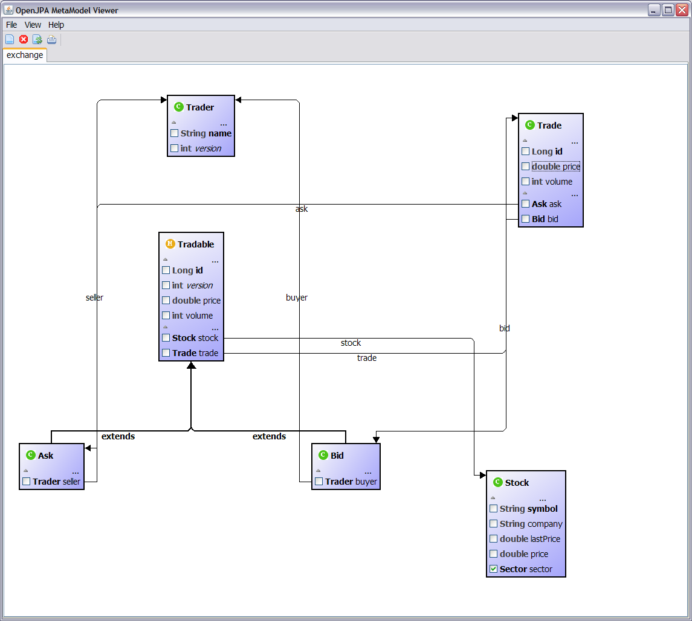

Title: Domain Model Browser

# Persistent Domain Browser

A graphic visualization of persistence domain classes.

    $ java org.apache.openjpa.tools.metamodel.MetamodelBrowser

## Classpath
  The runtime classpath must include

* OpenJPA runtime libraries
* The parent directory of persistence unit descriptor (META-INF/persistence.xml)
* The directory of compiled domain classes

* The persistence unit descriptor must enumerate the domain classes in its `<class>` tag.
* Database connection is not required.

## A typical snapshot 

