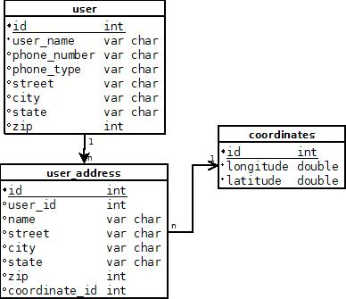
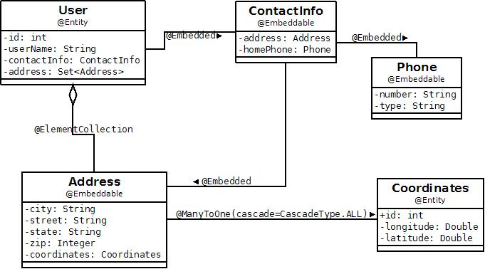

Title: Embeddable samples

## Embeddable classes
An entity may use other fine-grained classes to represent entity state.
Instances of these classes, unlike entity instances, do not have persistent
identity of their own. Instead, they exist only as part of the state of the
entity to which they belong. (From 2.0 Proposed Final Draft March 13, 2009
-- do I need to provide footnote or something?) 

In short, an embeddable is a seperation of data into a Java class that
relies on the owning Entity for it's identity. Many(most) times an
embeddable resides in the same database row as the owning Entity. 

Review the [getting started](getting-started.html)
 page on how to run the samples.

## Samples
<table>
<tr><th>Schema</th></tr>
<tr><td></td>
</tr>
</table>

<table>
<tr><th>Class diagram</th></tr>
<tr><td>
</tr>
</table>

* [Collections of Embeddables](#collections-of-embeddables.html)
* [Relationships from Embeddables](#relationships-from-embeddables.html)
* [Nested Embeddables](#nested-embeddables.html)

## Collections of Embeddables

In the code snippet below, there is a User Entity which has a collection of
Embedded addresses.

  

<B>Address.java|borderStyle=solid</B>

    @Embeddable
    public class Address {
    	@Basic
    	private String street;
    	@Basic
    	private String city;
    	@Basic
    	private String state;
    	@Basic
    	private Integer zip;
    
    	public Address(){
    	}
    //...
    }
 

  

<B>User.java|borderStyle=solid</B>

    @Entity
    public class User {
    	@Id
    	@GeneratedValue(strategy=GenerationType.IDENTITY)
    	private int id;
    
    	@ElementCollection
    	@CollectionTable(name="user_address")
    	private Set<Address> addresses = new HashSet<Address>();
    	
    	public User(){
    	}
    //...
    }
 

  

<B>JPQL.java|borderStyle=solid</B>

  
    ...
    // Select Entity based off a query over a collection of embeddables
    Query q = em.createQuery("SELECT u FROM User u , in (u.addresses) a WHERE a.state='xx'");
    // TODO -- add more!
    ...

## Relationships from Embeddables
In the code snippet below, there is an Address embeddable with a ManyToOne
relationship to a Coordinates Entity.

 

<B>Address.java|borderStyle=solid</B>

 
    @Embeddable
    public class Address {
    	@Basic
    	private String street;
    	@Basic
    	private String city;
    	@Basic
    	private String state;
    	@Basic
    	private Integer zip;
    	
    	@ManyToOne(cascade=CascadeType.ALL)
    	Coordinates coordinates;
    
    	public Address(){
    	}
    //...
    }

  

<B>Coordinates .java|borderStyle=solid</B>

    @Entity
    public class Coordinates {
    	@Id
    	@GeneratedValue(strategy=GenerationType.IDENTITY)
    	int id;
    	
    	@Basic
    	double longitude;
    	@Basic
    	double latitude;
    	public Coordinates(){
    	}
    	public Coordinates(double lon, double lat){
    		longitude=lon;
    		latitude=lat;
    	}
    //...
    }

  

<B>JPQL.java|borderStyle=solid</B>

  
    ...
    // Embedded -> relationship traversal
    Query q = em.createQuery("SELECT u FROM User u , in (u.addresses) a WHERE a.coordinates.longitude=xxx");
    // TODO -- add more!
    ...

## Nested Embeddables
In the code snippet below, there is a User Entity which has an embedded
ContactInfo. ContactInfo contains two other embeddeded embeddables, Address
and Phone.

  

<B>Address.java|borderStyle=solid</B>

  
    @Embeddable
    public class Address {
    	@Basic
    	private String street;
    	@Basic
    	private String city;
    	@Basic
    	private String state;
    	@Basic
    	private Integer zip;
    
    	public Address(){
    	}
    //...
    }

  

<B>Phone.java|borderStyle=solid</B>

  
    @Embeddable
    public class Phone {
    	@Basic
    	private String phone_number;
    	@Basic
    	private String phone_type;
    //...
    }

  

<B>ContactInfo.java|borderStyle=solid</B>

  
    @Embeddable
    public class ContactInfo {
    	public ContactInfo(){	
    	}
    	
    	@Embedded
    	Address homeAddress;
    	
    	@Embedded
    	Phone homePhone;
    //...
    }

  

<B>User.java|borderStyle=solid</B>

  
    @Entity
    public class User {
    	@Id
    	@GeneratedValue(strategy=GenerationType.IDENTITY)
    	private int id;
    	@Embedded
    	ContactInfo contactInfo;
    	
    	public User(){
    	}
    //...
    }

  

<B>JPQL.java|borderStyle=solid</B>

    ...
    // Nested embeddables traversal
    Query q = em.createQuery("SELECT u FROM User u WHERE u.contactInfo.homePhone.number='507-555-5555' " +
        "AND u.contactInfo.homePhone.type='cell'");
    // TODO -- add more!
    ...
