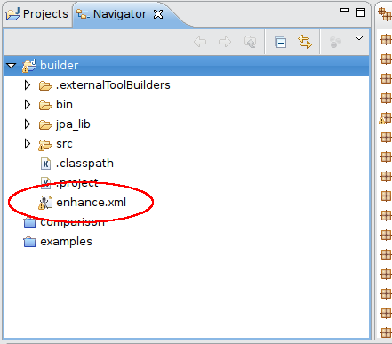
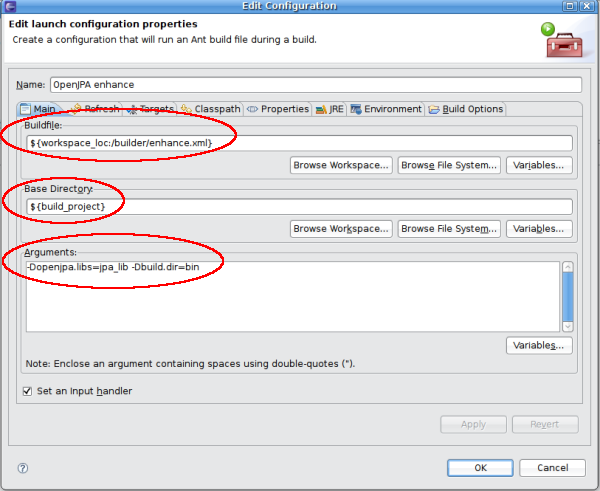
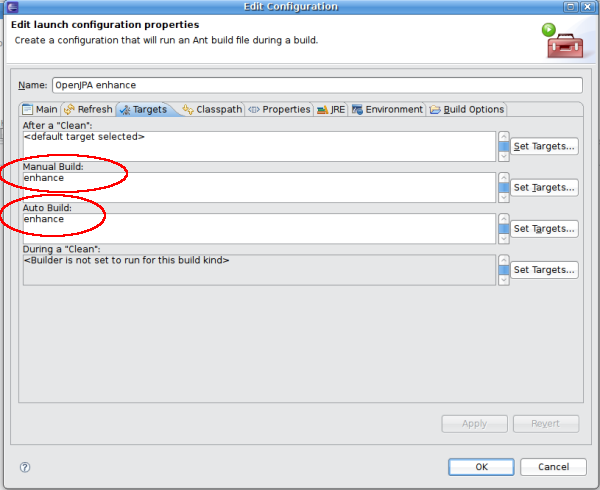

Title: Enhancement with Eclipse

# Enhancing Entities with Eclipse

If you are using Eclipse to write and deploy your application, then you
have two choices for **build time** enhancement of your entities.  But, if
you're using orm.xml to map the Entities, then you can only use the Custom
ANT Builder method below, as the OpenJPA Plugin for Eclipse currently does
not handle that scenario.

## Custom ANT Builder

For steps documented below, I have the following directory structure. Note,
these steps must be followed for each project that has Entities that need
to be enhanced.

    /builder_project
        enhance.xml <- the OpenJPA builder....
    /bin <- Compile directory
    /src <- Source directory
    /jpa_lib <- OpenJPA binary and all jars from the lib dir of the binary download
        commons-collections-3.2.jar
        commons-lang-2.1.jar
        commons-pool-1.3.jar
        derby-10.2.2.0.jar
        geronimo-jpa_2.0_spec-1.0-EA-SNAPSHOT.jar
        geronimo-jta_1.1_spec-1.1.1.jar
        openjpa-2.0.0-SNAPSHOT.jar
        serp-1.13.1.jar
    /lib <- other libs

1. After you add the [enhance.xml](artifacts/enhance.xml)
 file to your file system, make sure to refresh your Eclipse workspace so
it knows about the newly added file. Make sure that the enhance.xml file is
listed in the Navigator view (screenshot #1 below.)
1. Right click on the Eclipse project that you want to enhance and click on
Properties.
1. Click on the builders filter, and Create a new Ant builder.
1. Name your builder, then click on "Browse Workspace" in the buildfile box.
If you downloaded the enhance.xml file and refreshed your workspace, it
should be listed there. If not, go back to step 1 and make sure that
Eclipse detects your enhance.xml file.
1. In the "Base Directory" box, click on the variables button and select
build_project. This should refer to the root of your project. In the
directory structure above, it refers to "builder_project".
1. In the "Arguments" box you need to add the following properties
**-Dopenjpa.libs** and **-Dbuild.dir** (see screenshot #2 below.) The
-Dopenjpa.libs is the path to the OpenJPA libs, relative to the root of the
project. The -Dbuild.dir is the path to the build directory, relative to
the root of the project. In the directory structure above, openjpa.libs
should be set to jpa_lib and build.dir should be set to bin.
1. Click on the "Targets" tab along the top.
1. You need to set the enhance target to run as a part of "Manual Build" and
"Auto Build" (see screenshot #3 below.)
  
  

## OpenJPA Plugin for Eclipse

The OpenJPA Eclipse Tooling is a sub-project of the OpenJPA project.  It
develops IDE tooling for OpenJPA as an Eclipse feature with plug-ins.

The OpenJPA Eclipse Tooling does not have an official release as some known work-items still need to be addressed in [OPENJPA-1412](https://issues.apache.org/jira/browse/OPENJPA-1412).

There are also some known bugs with the bytecode produced by the eclipse plugin (e.g. [OPENJPA-1879](http://issues.apache.org/jira/browse/OPENJPA-1879), [OPENJPA-1887](https://issues.apache.org/jira/browse/OPENJPA-1887)).

Currently it provides an Eclipse Builder for OpenJPA Enhancement.

* [How to install the OpenJPA Eclipse Tooling](openjpaeclipseinstallation.html)
* [How to use the OpenJPA Eclipse Tooling Builder for Bytecode Enhancement](openjpaeclipseenhancementbuilder.html)
* [How to develop on and build the OpenJPA Eclipse Tooling](openjpaeclipsetoolingdevandbuild.html)
 
