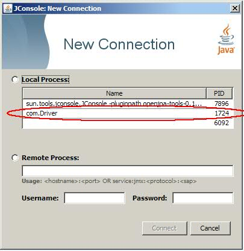
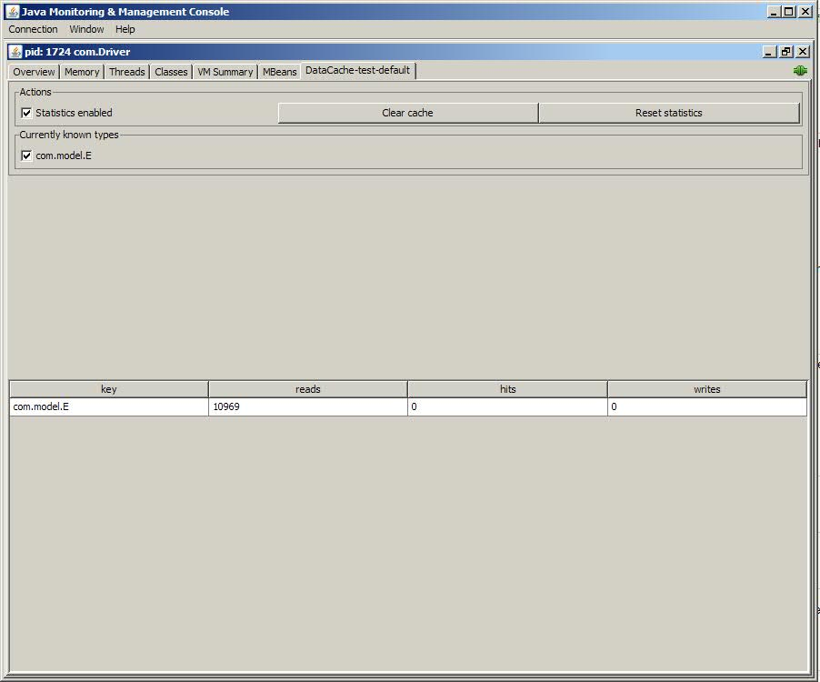

Title: JConsole DataCache Plugin

# JConsole DataCache Plugin

This plugin is used to extend the JConsole that is bundled as part of the [1.5 JDK](http://download.oracle.com/javase/1.5.0/docs/guide/management/jconsole.html)
. 

## Download

The latest OpenJPA Tools JAR file can be download from the [SNAPSHOT Repository](https://repository.apache.org/content/repositories/snapshots/org/apache/openjpa/tools/openjpa-tools/0.1.0-SNAPSHOT/)
 or can be built from the source code in [svn](https://svn.apache.org/repos/asf/openjpa/tools/trunk) by using Maven 2.2.1 and Java SE 6.

## JSE Usage

### This description assumes your application is running the on same machine as JConsole and application JVM matches the JConsole JVM.

1. Start an OpenJPA application with the following configuration properties
set:

        <property name="openjpa.DataCache" value="true"/>
        <property name="openjpa.Instrumentation" value="jmx(Instrument='DataCache')"/>

2. Launch JConsole and provide the openjpa-tools.jar via the -pluginpath
switch.

        > [java_home]\bin\jconsole -pluginpath [path_to_openjpa-tools.jar]

3. Select the PID which corresponds to your application.

    

4. If all goes well, at this point you should see a tab labeled DataCache-[pu_name]-[n]

    

## JEE Usage
// In progress
<http://wasdynacache.blogspot.com/2010/03/getting-jconsole-working-with-websphere.html>
