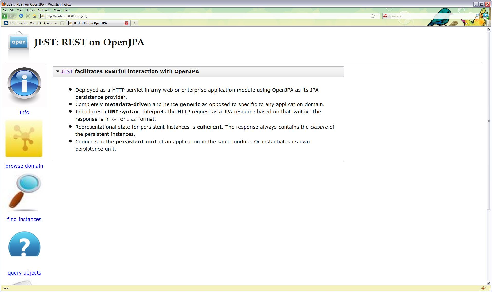

Title: JEST Examples

# JEST in Action

## Description of a Simple JEST-enabled Web Application
A sample is available to demonstrate JEST usage. You will find the example
in OpenJPA code repository under **openjpa-examples/jest** tree with its
source code and deployment descriptors **WEB-INF/web.xml** and
**META-INF/persistence.xml**. The example is a simple servlet
**demo.SimpleApp** that instantiates a persistent unit named **estdemo**
and populates a database with few sample records of two persistent entities
**demo.Actor** and **demo.Movie**.  

## Persistence Unit Initialization

The following code from  **demo.SimpleApp** shows the initialization
process at the servlet's **init()** method.

  

<B>Simple Servlet initializes a pooled Persistent Unit</B>

    public class SimpleApp extends HttpServlet {
        EntityManagerFactory _emf;
        private static String UNIT_NAME = "jestdemo";
        
        @Override 
        public void init(ServletConfig config) throws ServletException {
           super.init(config);
    	    config.getServletContext().log("Initializing persistence unit [" + UNIT_NAME + "]");
    	    try {
    	        Map<String,Object> props = new HashMap<String, Object>();
        	    props.put("openjpa.EntityManagerFactoryPool", "true");
        	    _emf = Persistence.createEntityManagerFactory(UNIT_NAME,props);
    	        new DataLoader().populate(_emf.createEntityManager());
        	} catch (Exception e) {
        	    throw new ServletException(e);
    	    }
    	    config.getServletContext().log("Initialized with persistence unit [" + UNIT_NAME + "]");
        }

It is **important** to notice that the persistent unit is instantiated so
that the `EntityManagerFactory` is pooled by OpenJPA. The way to achieve
that is to set configuration property `openjpa.EntityManagerFactoryPool`
to **true**. It is also important to note that this property is recognized
_only_ when passed via runtime and _not_ if it were specified in
`META-INF/persistence.xml` unlike other OpenJPA configuration properties.

Besides instantiating the persistent unit, the servlet does not do anything
else other than serving a welcome *index.html* web page as its
*doGet()* method shows:

  

<B>Simple Servlet that only serves a single index.html page</B>

  
    /**
     * The only response by this application is an <code>index.html</code> file.
     */
    @Override
    protected void doGet(HttpServletRequest req, HttpServletResponse resp)
            throws ServletException, IOException {
    	resp.setContentType("text/html");
    	OutputStream out = resp.getOutputStream();
    	InputStream in = getClass().getResourceAsStream("index.html");
    	for (int c = 0; (c = in.read()) != -1;) {
    	    out.write((char)c);
    	}
    }

## Deployment Descriptor to enable JEST

The sample web application deploys *demo.SimpleApp* servlet *and* JEST
servlet. The essential aspect of the deployment descriptor
*WEB-INF/web.xml* is shown below

  

<B>web.xml deployment descriptor (edited version)</B>

    <web-app version="2.4" 
	      xmlns="http://java.sun.com/xml/ns/j2ee" 
	      xmlns:xsi="http://www.w3.org/2001/XMLSchema-instance" 
	      xsi:schemaLocation="http://java.sun.com/xml/ns/j2ee
          http://java.sun.com/xml/ns/j2ee/web-app_2_4.xsd">
        <display-name>Demo Application with JEST Servlet</display-name>  
        <welcome-file-list>
            <welcome-file>index.html</welcome-file>
        </welcome-file-list>
        <servlet>
            <servlet-name>demo</servlet-name>
            <servlet-class>demo.SimpleApp</servlet-class>
        </servlet>
        <servlet-mapping>
            <servlet-name>demo</servlet-name>
            <url-pattern>/*</url-pattern>
        </servlet-mapping>
    
        <servlet>
            <servlet-name>jest</servlet-name>   
            <servlet-class>org.apache.openjpa.persistence.jest.JESTServlet</servlet-class>
            <init-param>
                <param-name>persistence.unit</param-name>
                <param-value>jestdemo</param-value>
            </init-param>
        </servlet>
        <servlet-mapping>
            <servlet-name>jest</servlet-name>
            <url-pattern>/jest/*</url-pattern>
        </servlet-mapping>
  
    </web-app>

    
## Discovery of Persistent Unit
As can be seen in `WEB-INF/web.xml` above, the JEST servlet
`org.apache.openjpa.persistence.jest.JESTServlet` needs to know the
persistent unit name `jestdemo` to _discover_ the actual
`EntityManagerFactory` instantiated by its sibling `demo.SimpleApp`
servlet. This discovery of an `EntityManagerFactory` instantiated by
another component is possible because the said
    `EntityManagerFactory` is being pooled by OpenJPA. A more general
discovery mechanics where JEST can discover a `EntityManagerFactory`
instantiated and injected by the container 
    would be available in future. 
    
## Building the sample application
An Ant build script `build.xml` is provided and a `build.properties` to
adjust for local settings. To suit your local environment, please edit the
`build.properties` for OpenJPA library and `META-INF/persistence.xml`
for database specifics. The supplied build file compiles two persistent
domain classes `demo.Actor` and `demo.Movie`, enhanced them and
packages them in an web archive `demo.war`. The script assumes that the
OpenJPA library and the JDBC driver (the sample persistence descriptor uses
MySQL, by deafult) are available in shared library of the Servlet Container
and hence does _not_ package these libraries in the web archive
`demo.war`.
    
## Deploying the sample application
    
The next step is to deploy this simple web archive `demo.war` in a
Servlet Container such as Tomcat or a a JEE container. We do not describe
these steps because they are fairly standard.  
    
## JEST in action
    
Once the sample web application is deployed, say in Tomcat running on
`localhost:8080`, open the web browser <http://localhost:8080/demo> and
you should see the web page  served by `demo.SimpleApp`. This step
initializes `demo.SimpleApp` and hence the persistence unit `jestdemo`. 
    
Now, if you go to URL <http://localhost:8080/demo/jest/>, the JEST
welcome page will be displayed -- which is JavaScript enabled web page that
demonstrates currently available JEST facilities such as finding or
querying for instances.  
         
