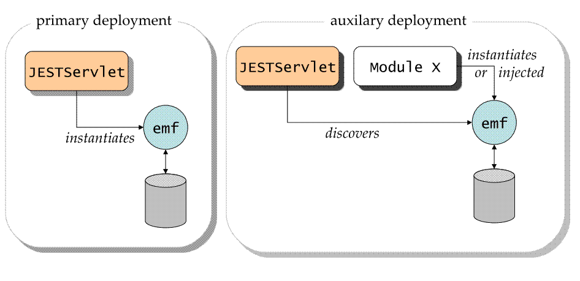

Title: JEST Usage

JEST facilities are available as a HTTP servlet,
`org.apache.openjpa.persistence.jest.JESTServlet`. 
 
`JESTServlet` can be deployed in a servlet container e.g. Tomcat in two
possible modes: **primary** or **auxiliary**. 

### Deployment Modes

 
In **primary** mode, the `JESTServlet` itself instantiates a persistence
unit during initialization. 

In **auxiliary** mode,  the `JESTServlet` discovers a persistence unit used
by another component `X`.
The sibling component `X` must satisfy the following for JEST to discover
its persistent unit
 
* The component `X` and `JESTServlet` must belong to the same
deployment unit.
* The component `X` must activate OpenJPA's native
`EntityManagerFactory` pool. The pool is activated by switching on
`openjpa.EntityManagerFactoryPool` configuration property to `true`.
This property is available _only_ via runtime configuration. The following
code example ensures that OpenJPA's native `EntityManagerFactory` pool is
active.

<B>Activation of OpenJPA's native EntityManagerFactory pool</B>

  
    Map<String,Object> props = new HashMap<String, Object>();
    props.put("openjpa.EntityManagerFactoryPool", "true");
    EntityManagerFactory emf = Persistence.createEntityManagerFactory("myPU",props);

`JESTServlet` accepts following initial configuration parameters

<table>
<tr><th>Property</th><th>Description</th></tr>
<tr><td class="border">persistence.unit</td><td class="border">Name of the persistent unit. Must be specified.</td></tr>
<tr><td class="border">standalone</td><td class="border">true implies primary mode. Defaults to false.</td></tr>
<tr><td class="border">debug</td><td class="border">true implies verbose tracing of HTTP requests. Defaults to false.</td></tr>
</table>

The following deployment descriptor *WEB-INF/web.xml* deploys
*JESTServlet* in auxiliary mode

<B>JEST Deployment Descriptor in Auxiliary Mode</B>

  
    <web-app version="2.4" 
	        xmlns="http://java.sun.com/xml/ns/j2ee" 
	         xmlns:xsi="http://www.w3.org/2001/XMLSchema-instance" 
	         xsi:schemaLocation="http://java.sun.com/xml/ns/j2ee
            http://java.sun.com/xml/ns/j2ee/web-app_2_4.xsd">
        <display-name>Demo Application with JEST Servlet</display-name>  
        <welcome-file-list>
	        <welcome-file>index.html</welcome-file>
        </welcome-file-list>
        <description>
            An example of deploying a simple web application with JEST servlet.
            This descriptor specifies the Demo Application servlet as well as JEST servlet.
        </description>
  
        <servlet>
            <description> 
	            This is the Demo Application Servlet.
	            The servlet is mapped to URL pattern /app/* so this servlet can be accessed as
		             http://host:port/demo/app/ 
	            where "demo" is the name of the deployed web application.
   		                  
	            Assume that the Demo Application Servlet is using a persistence unit named 
	            'jestdemo'. The JEST Servlet will require the persistence unit name to
	            browse the Demo Application.		      
            </description>
   		
            <servlet-name>demo</servlet-name>
            <servlet-class>demo.SimpleApp</servlet-class>
        </servlet>
  
        <servlet-mapping>
            <servlet-name>demo</servlet-name>
            <url-pattern>/*</url-pattern>
        </servlet-mapping>
  
        <!-- Deployment descriptor for JESTServlet.	    -->
        <servlet>
            <description>
	            This is the JEST servlet. 
	            JEST Servlet needs to know the name of the persistence unit used by the 
	            Demo Application. The unit name is specified by mandatory "persistence.unit" 
	            parameter during initialization.
  		
	            The JEST servlet is mapped to URL pattern /jest/* in servlet mapping section. 
	            So to access JEST servlet, use the following URI
	                http://host:port/demo/jest/
	            Notice the trailing forward slash character is significant.	
            </description>
            <servlet-name>jest</servlet-name>
 
            <servlet-class>org.apache.openjpa.persistence.jest.JESTServlet</servlet-class>
            <init-param>
	            <param-name>persistence.unit</param-name>
	            <param-value>jestdemo</param-value>
            </init-param>
            <init-param>
	            <param-name>debug</param-name>
	            <param-value>true</param-value>
            </init-param>
        </servlet>
        <servlet-mapping>
            <servlet-name>jest</servlet-name>
	        <url-pattern>/jest/*</url-pattern>
        </servlet-mapping>
    </web-app>

