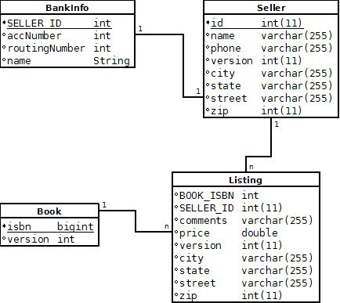
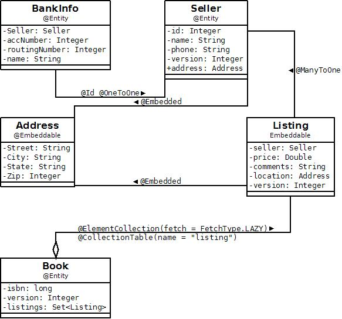

Title: JPA M2 Demo

### M2 Demo
We have created a demo that shows off a subset of the new features that
were added during the [second milestone](release-management.html#milestone-2)
. The code that is being demoed can be found in the openjpa-examples module
under the src/jpastore directory.

### Domain Info

<table>
<tr><td></td></tr>
<tr><td></td></tr>
</table>

### Video

<table>
<tr></tr>
{HTML}
<object width="853" height="505"><param name="movie"
value="http://www.youtube.com/v/Bb1NR81V4Gw&hl=en&fs=1&hd=1"></param><param
name="allowFullScreen" value="true"></param><param name="allowscriptaccess"
value="always"></param><embed
src="http://www.youtube.com/v/Bb1NR81V4Gw&hl=en&fs=1&hd=1"
type="application/x-shockwave-flash" allowscriptaccess="always"
allowfullscreen="true" width="853" height="505"></embed></object>
{HTML}
<tr></tr>
