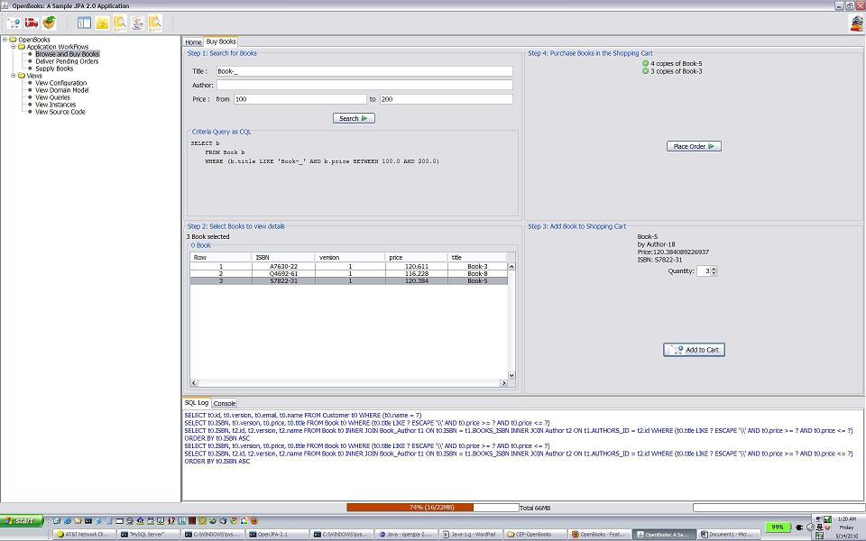
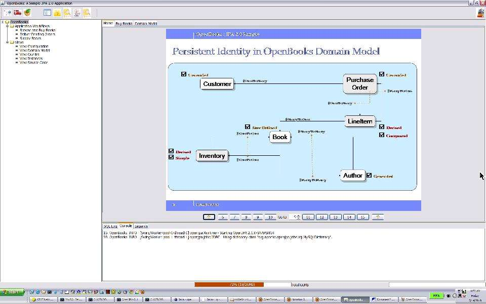
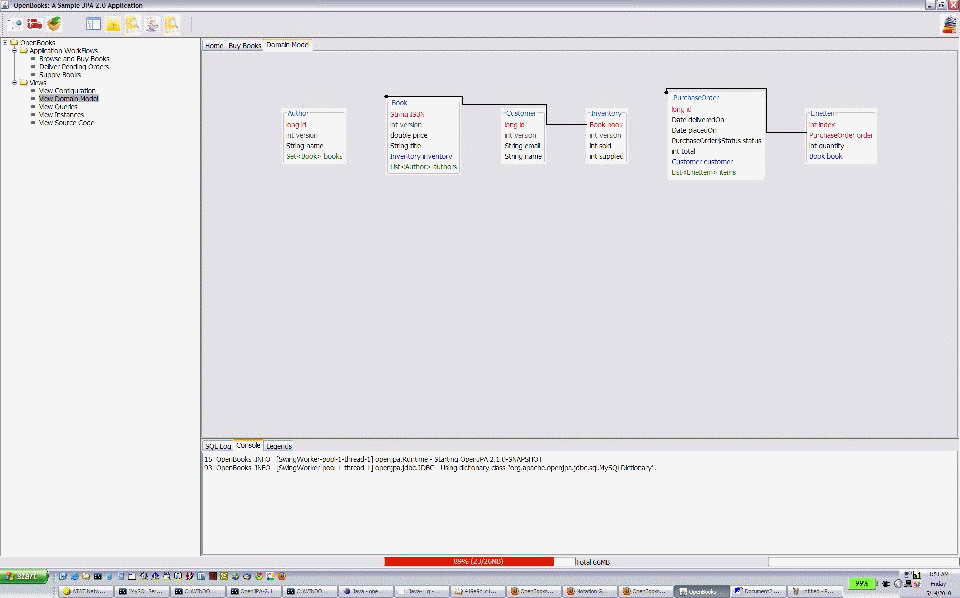

Title: OpenBooks - Featuring JPA 2.0

OpenBooks is a sample (and perhaps, simple) application featuring some of
the new features in JPA 2.0.
This demonstration features usage of new JPA 2.0 features such as 

  * Criteria Query
  * Compound, Derived identity
  * Orphan Delete
  * Persistent Domain Model API 

The sample application shows essential build and packaging steps for both
as 

  * a Swing-based JSE application and 
  * a typical Web Application Archive (*.war) ready to be deployed in a
Java Enterprise container.  

OpenBooks demonstrates few useful practices in domain modeling such as
composite persistent relations,
isolating immutable state for better cache utilization, immutable
relationship etc. Architecturally,
OpenBooks uses a design pattern to enable the same persistence service be
used inside and outside
a managed environment. Such patterns vastly speeds up develop-test-debug
cycle for persistence and
object-relation mapping functionality outside a container.   

## Availability
The source code and build script for OpenBooks is available in OpenJPA
SubVersion repository under *openjpa-examples/openbooks*

To access the source code

    $ svn co https://svn.apache.org/repos/asf/openjpa/trunk/openjpa-examples/openbooks

## Building

  * Follow the [instruction](building-and-running-openbooks.html)
 to build and run OpenBooks. 
These instructions can also be found also in `index.html` at the `OpenBooks` root directory.

Here are few screen shots of OpenBooks running as a Swing Application.

### Selecting and Purchasing Books 

  

### Persistent Domain Model (as a Powerpoint Slide)

### Browsing the same domain model via Metamodel API 

