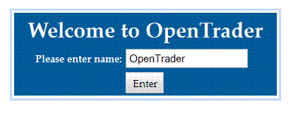
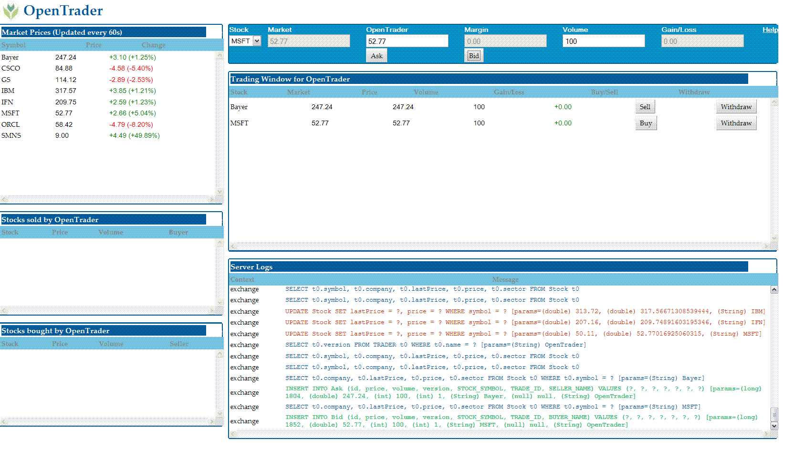

Title: OpenTrader

h1. OpenTrader: a transactional, web application with Google Web Toolkit,
OpenJPA/Slice on Tomcat

OpenTrader is a sample web application to demonstrate integration of Google
Web Toolkit (GWT) and OpenJPA running in Tomcat Servlet Container. These
pages describe various aspects of this end-to-end application. The
following sections are fairly independent of each other and can be followed
as such based on your interest.
 
* [Architecture](opentraderarchitecture.html)
 and core design goals 
* The [computing environment](opentraderenvironment.html)
 requirement
* Developing a [GWT Client](opentraderclient.html)
* Developing a [JPA based Server](opentraderserver.html)
* [Communication](opentradercommunication.html)
 between the components
* [Building](opentraderbuild.html)
 the application
* [Deploying](opentraderdeploy.html)
 the application

GWT takes a position that is a significantly unique among the multitude of
frameworks available to build a browser based client. GWT framework is
based on several key concepts:

* an asynchronous RPC protocol for communication between web client and
server. Such asynchronous RPC is popularized by AJAX (Asynchronous
JavaScript and XML) since last several years.
* a cross-compiler that converts Java to JavaScript. This is the most
critical component in the framework as it allows the client be written
completely in Java. Besides adding a comfort layer for Java developers, the
cross-compiler solves one of the most complex issue of browser based
clients namely cross-browser compatibility. The cross-compiler generates
separate JavaScript targeted to prominent browsers and the framework knows
to activate the appropriate JavaScript based on the particular browser a
client is using.
* a library of interactive visual widgets such as dialog boxes,
combo-boxes, tables etc. This Java based library realizes the widget as the
elements of a Document Object Model (DOM) for a browser to render them in
HTML. For example, an instance of **com.google.gwt.user.client.ui.FlexTable** 
urns into a **&lt;table&gt;** in the
displayed HTML page by the framework. The widget library not only provides
rendering support, it also comes with a event dispatching model for the
client application to handle the user interaction. 

OpenTrader - the sample example described in these pages - demonstrates how
to develop a GWT client for a transactional, server application based on
Java Persistence API (JPA). This example is somewhat more involved than a
typical AddressBook example in terms of the complexity of the domain model,
the transactional functions of the server as well as the interaction
between multiple widgets in the client. Also the sample application covers
a realistic use case where the core server application is defined
independent of both GWT and JPA -- and then demonstrates how these two
technologies are used to _implement_ an end-to-end service running inside a
Tomcat Servlet Container. 

Follow the steps to view OpenTrader source code, build the application,
deploy it in your favorite application container and run it in your
favorite browser.

### 1. Get the source code

   OpenTrader source code is available as one of the OpenJPA examples.
Checkout the source files in a directory.

$ svn checkout <https://svn.apache.org/repos/asf/openjpa/trunk/openjpa-examples/opentrader>

The source tree comes with 

   * Ant build script: *build.xml* and *build.properties*
   * Java source code for OpenTrader application under *src/main/java*
   * GWT module descriptor  : *OpenTrader.gwt.xml* under *src/main/java/org/apache/openjpa/trader*
   * Persistence descriptor : *persistence.xml* under *src/main/resources/META-INF*
   * web descriptor	    : *web.xml* under *src/main/resources/WEB-INF*
   * cascading style sheet  : *OpenTrader.css* under *src/main/resources/css*
   

### 2. Build

To build OpenTrader you will require following other libraries. 
   
   * **Google Web Toolkit**: We have built it with GWT version 2.0.4 which
can be downloaded from [here](http://google-web-toolkit.googlecode.com/files/gwt-2.0.4.zip)
.
   * **cobogw widget library**: Provides rounded panel not using them seems
to be too un-cool. Download version 1.3.1 from [here](http://code.google.com/p/cobogw/downloads/list)
.
   * and, of course, **OpenJPA libraries**: OpenJPA now comes with all its
dependencies neatly packaged in a single jar including the JPA API.
Download from [this site](http://www.apache.org/dyn/closer.cgi/openjpa/2.0.0/apache-openjpa-2.0.0-binary.zip)
. 

#### 2.1 Configure build environment 
      
Edit  **build.properties** to point to the dependent libraries you
have downloaded. The file contains the instructions as comments. 

#### 2.2 Compile with Ant

Compile the application. Compilation involves three separate
compilation process. First the plain old **javac** compilation. Followed by
GWT cross-compiler that translates Java code into JavaScript. And finally
OpenJPA compilation that adds few bytecodes to the persistent classes to
manage their persistent behavior (which is also known as bytecode
enhancement).
     
    $ ant compile

GWT Compiler takes ages. Even though it only compiles for a single
browser (FireFox). This is controlled by the following directives in the
module descriptor *OpenTrader.gwt.xml*

	<set-property name="user.agent" value="gecko1_8"/> 

### 3. Run
    
You can run either in _hosted_ mode - an environment provided by GWT to
run within a Jetty container - or in a proper servlet container such as
Tomcat, Geronimo or GlassFish or even heavy-duty ones such as WebSphere or
Weblogic. In either case, you have to configure the *persistence.xml*
found under **src/main/resources/META-INF**. This descriptor specifies the
database used by OpenTrader.

	<property name="openjpa.ConnectionDriverName" value="com.mysql.jdbc.Driver"/>
	<property name="openjpa.ConnectionURL" value="jdbc:mysql://localhost/exchange"/>
	<property name="openjpa.ConnectionUserName" value="whoami"/>
	<property name="openjpa.ConnectionPassword" value="secret"/>
 
Also edit the **jdbc.driver** in **build.properties** for the
driver/database you have selected.

Now, for hosted mode, simply fire Ant as

     $ ant devmode

This should again take a very long time and pop open a horrible looking
Swing console titled **GWT Development Mode**. Go to **Development Mode** tab
and click **Launch Default Browser**. On my FireFox browser, that opens up
the page
<http://127.0.0.1:8888/OpenTrader.html?gwt.codesvr=127.0.0.1:9997>. If
all goes well, at this point your browser will prompt you with a welcome
dialog box

Once you have entered OpenTrader, the browser application looks like 

    
In this page, you can place a trade offer to sell or buy some stocks. To
really commit a trade you will need a matching offer. Now as a trader offer
can only match to another trader's offer, you need to open another browser
page with a different name. In FireFox, the tab will show the Trader name.
Now if one Trader makes an offer that match another Trader's offer, then
clicking the **Sell** or **Buy** button will commit the trade and will
appear on the Trading History Window. Also notice the Server Log window.
That will display SQL issued for every action by the server. You will also
notice SQL being logged even if you are not pressing any buttons. Thatis
because the Market Data Panel (the one in th etop-left corner) is
refreshing the market prices for the Stocks by a periodic call to the
server. As the stock prices change, that change is reflected on the
gain/loss column of the waiting trade offers. All this dynamic partial
update occurs in the same browser page -- that is what GWT offers.
